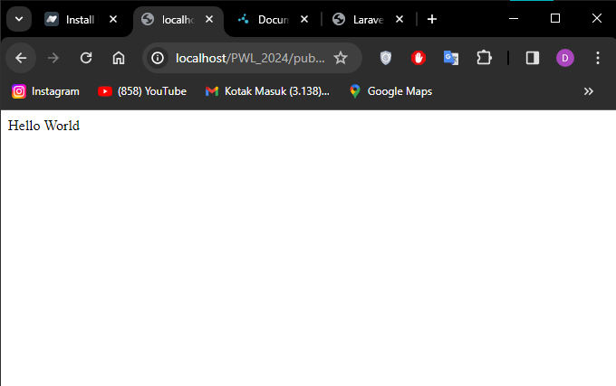
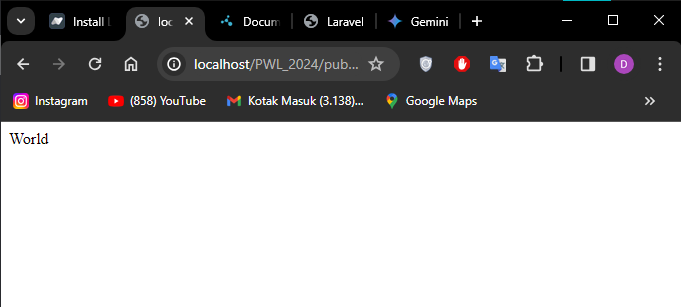
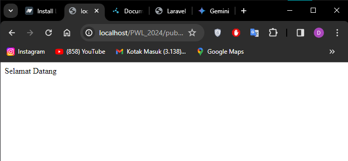
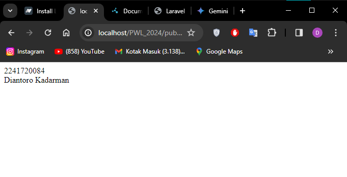
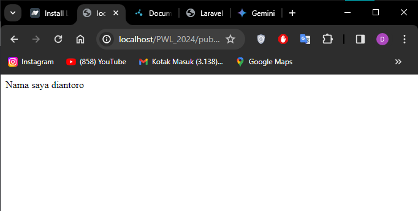
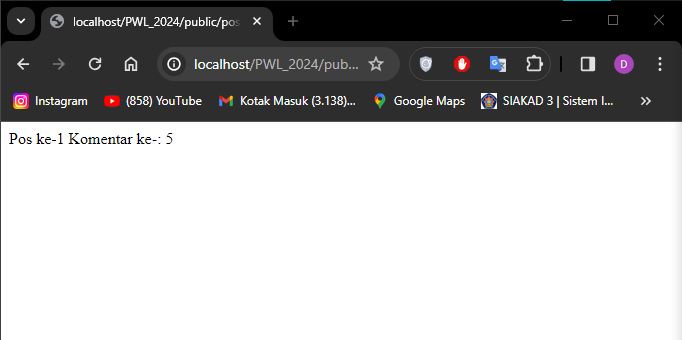
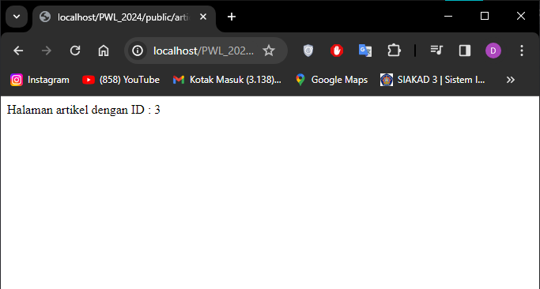
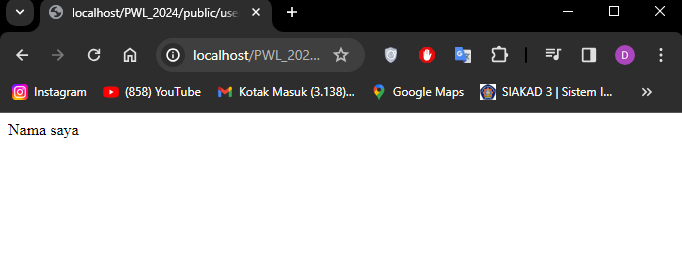
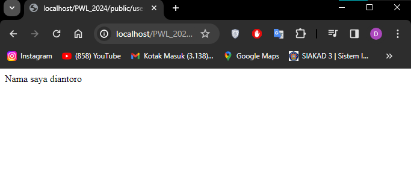
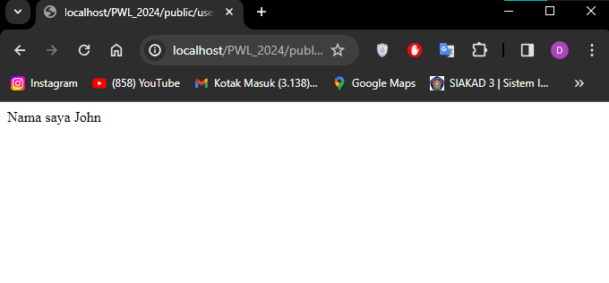

## LAPORAN JOBSHEET 2

Diantoro Kadarman  
2F / 08  
2241720084

#

### Langkah Praktikum

-   BASIC ROUTING

1. Menampilkan route /hello ke browser 
2. Menampilkan route /world ke browser 
3. Menampilkan route /selamat ke browser 
4. Menampilkan route /about ke browser 

##

-   ROUTE PARAMETERS

1. Memanggil route /user/{name} sekaligus mengirimkan parameter berupa nama user 

2. Memanggil route yang memiliki lebih dari 1 parameter berupa /posts dan comment 

3. Memanggil route /articles{id} dengan input nilai parameternya pada url 

##

-   OPTIONAL PARAMETERS

1. Nama tidak muncul karena pada url tidak diisi parameternya sehingga menampilkan nilai defaultnya yaitu null  

2. Ketika parameter diberi nilai pada URLnya maka akan menampilkan nilai tersebut  

3. nilai default parameter berisi "John" sehingga ketika tidak diberi nilai paramternya akan tetap menampilkan nilai defaultnya 
